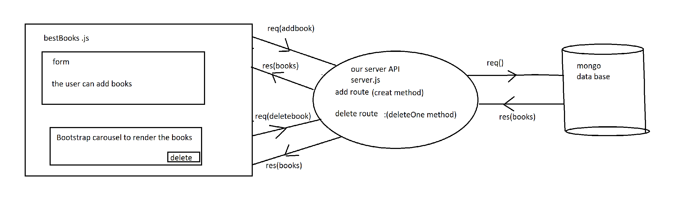

# Project Name

**Author**: Walaa' Atiyh & Amani Al-Zoube
**Version**: 1.0.0 (increment the patch/fix version number if you make more commits past your first submission)

## Overview
<!-- Provide a high level overview of what this application is and why you are building it, beyond the fact that it's an assignment for this class. (i.e. What's your problem domain?) -->

## Getting Started

**Backend side**

   #### lab 11 
1- add mongoose to my server  [source!](https://mongoosejs.com/docs/)
 * npm i mongoose --save

 2- creat schema &model in other file then requiring in app.js

 3-seed your database "insert initial data "

 4- creat books route to get the request and send the response to the user "front end" using json formate
 5- use a Bootstrap carousel to render all the books returned.
#### lab 12:
1- add navigate between Home and About "pages".
2- 

## Architecture
### lab 11:

### lab 12:

## Change Log
4/9/2022 lab 11 :

the application have mongo data base with initial data.render all the books returned using slides.

5/9/2022 lab 12:
user to create a book resource in the database or delete one.

## Estimates
<!-- See below -->

## Credit and Collaborations
my partner is Amani ALZoubi , we build the workflow

## Time Estimates

**lab 11 at 4/9/2022**

Name of feature: READ of CRUD

Estimate of time needed to complete: 5hours

Start time: 3.00pm sunday

Finish time: 1.51 am monday

Actual time needed to complete: 8 hours

**lab 12 at 5/9/2022**

Name of feature: READ of CRUD

Estimate of time needed to complete: 10hours

Start time: 8.00pm monday

Finish time: 

Actual time needed to complete: 